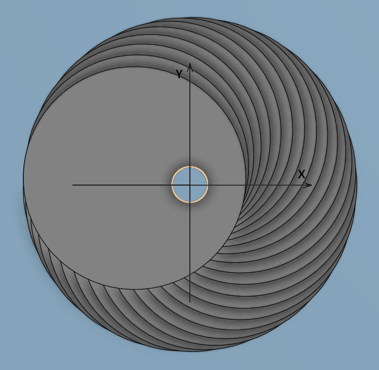
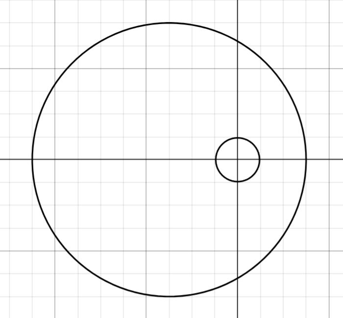
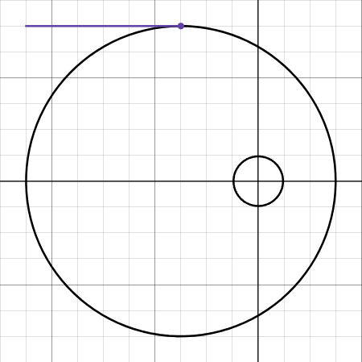

# Kinetic-Sculpture-Cams

  

  

This kinetic sculpture is designed to simulate an ocean wave with small height relative to its wavelength, which approximates a sine function. In order to achieve this behaviour, I have created $$n$$ _concentric_ cams which are identical to each other, but have a phase shift relative to each other, such that each subsequent cam is offsetted by $$Φ$$ degrees. Each cam has its own rectangular follower that falls and rises as the cam moves.

Making the (theoretical but not real) assumption that the tangent point of contact between the cam and the rectangular follower is at some point $$y_{t}$$ along $$x=0$$, $$(0, y_{t})$$, I aim to prove that this configuration produces a pure sine function.  

## Setup

Let us start by parametrically defining the equation of a circle $$\vec{r}\(t)$$ with an offset from the origin. Let $$R$$ be the radius, $$a$$ be the x-offset and $$b$$ be the y-offset. So we can define our circle by

$$\vec{r}\(t)=
\begin{bmatrix}
   R\cos\left(t\right)+a\\
   R\sin\left(t\right)+b
\end{bmatrix}
$$

$$t \in [0, 6\pi]$$

  

In order to represent the circle as it rotates for an angle $$\theta$$, we will multiply the parametric vector equation by the rotation matrix

$$R\(\theta)=
\begin{bmatrix}
   \cos\left(\theta\right) & -\sin\left(\theta\right)\\
   \sin\left(\theta\right) & \cos\left(\theta\right)
\end{bmatrix}
$$

Such that now we have 

$$\vec{r}\(t, \theta)=R(\theta)
\begin{bmatrix}
   R\cos\left(t\right)+a\\
   R\sin\left(t\right)+b
\end{bmatrix}
$$

$$\vec{r}\(t, \theta)=
\begin{bmatrix}
   \cos\left(\theta\right) & -\sin\left(\theta\right)\\
   \sin\left(\theta\right) & \cos\left(\theta\right)
\end{bmatrix}
\begin{bmatrix}
   R\cos\left(t\right)+a\\
   R\sin\left(t\right)+b
\end{bmatrix}
$$

$$\vec{r}\(t, \theta)=
\begin{bmatrix}
   \left(R\cos\left(t\right)+a\right)\cos\left(\theta\right) -\left(R\sin\left(t\right)+b\right)\sin\left(\theta\right)\\
   \left(R\cos\left(t\right)+a\right)\sin\left(\theta\right) +\left(R\sin\left(t\right)+b\right)\cos\left(\theta\right)
\end{bmatrix}
$$

## Derivation
We know that, at its highest point, the tangent to the curvature will have a vector $$\vec{v}(t, \theta)$$, with a negative x-component and a zero y-component

  

 

We can find $$\vec{v}(t, \theta)$$ by

$$\vec{v}(t, \theta)=\frac{d}{dt}\vec{r}\(t, \theta)$$

$$\vec{v}(t, \theta)=\frac{d}{dt}\begin{bmatrix}
   \left(R\cos\left(t\right)+a\right)\cos\left(\theta\right) -\left(R\sin\left(t\right)+b\right)\sin\left(\theta\right)\\
   \left(R\cos\left(t\right)+a\right)\sin\left(\theta\right) +\left(R\sin\left(t\right)+b\right)\cos\left(\theta\right)
\end{bmatrix}$$

$$\vec{v}(t, \theta)=\begin{bmatrix}
   -R\sin\left(t\right)\cos\left(\theta\right)-R\cos\left(t\right)\sin\left(\theta\right)\\
   -R\sin\left(t\right)\sin\left(\theta\right)+R\cos\left(t\right)\cos\left(\theta\right)
\end{bmatrix}$$

Let us solve for the y-component, $$v_{y}$$, when it is equal to $$0$$

 $$v_{y}=0$$

 $$-R\sin\left(t\right)\sin\left(\theta\right)+R\cos\left(t\right)\cos\left(\theta\right)=0$$

 $$$$
