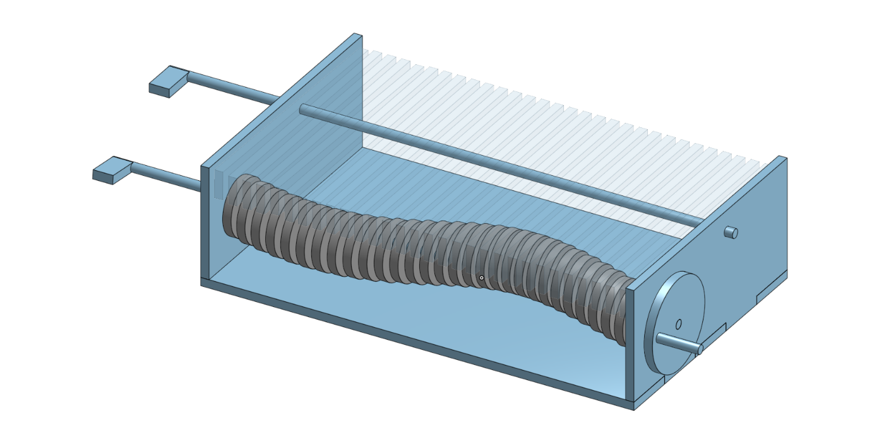

# Kinetic-Sculpture-Cams

  

This kinetic sculpture is designed to simulate an ocean wave with small height relative to its wavelength, which approximates a sine function. In order to achieve this behaviour, I have created $$n$$ _concentric_ cams which are identical to each other, but have a phase shift relative to each other, such that each subsequent cam is offsetted by $$Φ$$ degrees.

